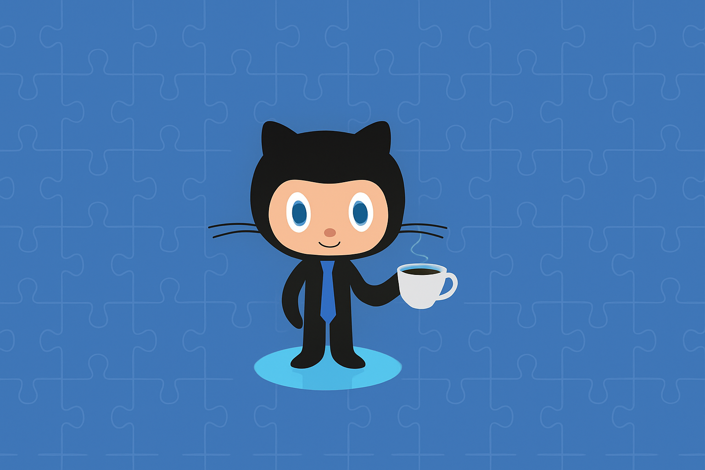

<h1 align="center"><b>Hi , I'm Melvin Ernesto </b></h1>

### 💫 About Me:

<h4> I am a student of the Computer Systems Engineering program. </h4>

### 🎓 My Skills Include:

<h4> 📋 Languages </h4>
 
  
  
  
  
  
  
  
  

----
<h4> 📚 Frameworks, Platforms and Libraries: </h4>

  
  
  
  
  
  

----
<h4> 💾 Databases: </h4>

  

----
<h4> 💻 IDE: </h4>

----
<h4> 🕓 Version Control: </h4>

   

----
#### 📊 GitHub Stats:
 
 

